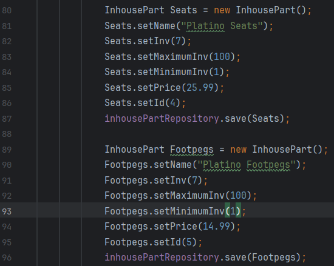
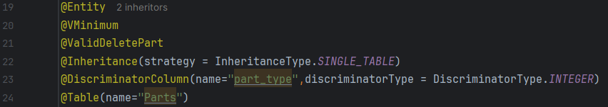

 WESTERN GOVERNORS UNIVERSITY 
D287 – JAVA FRAMEWORKS

**Section C.** 
**Customize the HTML user interface for your customer’s application. The user interface should include the shop name, the product names, and the names of the parts:** 
 
mainscreen.html, line 13: Added a CSS reference link to Demo.css  
mainscreen.html, line 15: Changed the title from "Shop" to "My Dominican Motorcycle Shop". 
mainscreen.html, line 20: Added a class to the h1 tag called "gradient-text". 
mainscreen.html, line 20: Added a div with the class called "flag" with an img src link to an image of the Dominican flag. 
mainscreen.html,line 20: Changed the text within the h1 tag to "The Dominican Motorcycle Shop". 
 

demo.css, line 1: Added css to ".gradient-text" to change the color of the text within the h1 tag. 
demo.css,line 9: Added a background image of an island coast and changed the color of the text within to aliceblue. 
demo.css, line 19: Changed the color within class ".thead-dark" to alice blue. 
demo.css, line 21: Changed color within tr tag of the tables to dodger blue and text to aliceblue. 
 
    
**Section D.**  
**Add an “About” page to the application to describe your chosen customer’s company to web viewers and include navigation to and from the “About” page and the main screen:** 

About.html, line 1 to line 56: Created an "about me" page with a button to link to "/mainscreen". 
 
 

AboutScreenController.java, line 1 to line 12, Created a new class that maps the "aboutscreen" page.  
 

demo.css, line 25: Added a new background image,shaped it to fit the screen, and changed the color of the font to aliceblue. 
demo.css, line 36: Added class ".text-and-flag" with a flex display so the image and text can be side by side. 
demo.css, line 41: Added ".flag" class to adjust the size of the image. 
demo.css, line 46: Added ".gradient-text h1" to color the "About Us" text. 
 

demo.css, line 54: Added "text-content p". Changed the font to cambria, changed the margin  and colored the background to mirror the Dominican flag colors. 
demo.css, line 62: Added "text-content h1" to adjust the bottom margin of the text. 
demo.css, line 66: Added "second-para" to align and shape the second paragraph. 
demo.css, line 73: Added "second-para p" to give it the background Dominican flag colors. 
demo.css, line 82: Added "store-hours" class to adjust the width. 
 

demo.css, line 86: Added "store-hours h3" to shorten the bottom marging of "Shop Hours" 
demo.css, line 91: Added "store-hours p" to shorten the margins of the store times. 
demo.css, line 96: Added "btns", used for both "aboutscreen" and "mainscreen" and colored the buttons the same as the Dominican flag. 
demo.css, line 110: Added color to .btns:hover.  
 

mainscreen.html, line 21: Added a button, "About Us", to link to aboutscreen page. 
     

**Section E. Add a sample inventory appropriate for your chosen store to the application. You should have five parts and five products in your sample inventory and should not overwrite existing data in the database:**

BootStrapData.java, line 45: Created an IF statement to prevent any duplicate outsourced parts. 
BootStrapData.java, line 47 - line 53: Created an object called "Raider" thats holds the "Yamaha Raider Motor" item part information and saved it to OutsourcedPartRepository.  
BootStrapData.java, line 55 - line 61: Created an object called "R125" thats holds the "Yamaha R125 Handlebars" item part information and saved it to OutsourcedPartRepository. 
BootStrapData.java, line 63 - line 69: Created an object called "Gearshift" thats holds the "Honda Cargo125 Gear Shift Shaft" item part information and saved it to OutsourcedPartRepository. 
 

BootStrapData.java, line 72: Created an IF statement to prevent any duplicate insourced parts. 
BootStrapData.java, line 74 - line 79: Created an object called "Seats" thats holds the "Platinos Seats" item part information and saved it to InhousePartRepository. 
BootStrapData.java, line 81 - line 86: Created an object called "Footpegs" thats holds the "Platinos Footpegs" item part information and saved it to InhousePartRepository. 
BootStrapData.java, line 91: Created an IF statement to prevent any duplicate products. 
BootStrapData.java, line 92: Created a Dominican Men's jacket object called "DRJacket", with it's name, price, and inventory quanity information. 
BootStrapData.java, line 93: Created a Dominican Women's jacket object called "DRJacketF", with it's name, price, and inventory quanity information. 
BootStrapData.java, line 94: Created a Dominican themed helmet object called "DRHelmet",with it's name, price, and inventory quanity information. 
BootStrapData.java, line 95: Created a Dominican themed children's helmet object called "DRHelmetC", with it's name, price, and inventory quanity information. 
BootStrapData.java, line 96: Created a Dominican themed synthetic oil product object called "DROil", with it's name, price, and inventory quanity information. 
BootStrapData.java, line 97: Saved DRJacket to productRepository. 
BootStrapData.java, line 98: Saved DRJacketF to productRepository. 
BootStrapData.java, line 99: Saved DRHelmet to productRepository. 
BootStrapData.java, line 100: Saved DRHelmetC to productRepository. 
BootStrapData.java, line 101: Saved DROil to productRepository. 
 

application.properties, line 6: Changed the datasource.url name to "cmorera_2". 
 

**Section F.**  
**Add a “Buy Now” button to your product list. Your “Buy Now” button must meet each of the following parameters:** 

**The “Buy Now” button must be next to the buttons that update and delete products:**

mainscreen.html,line 87: Added a "Buy Now" button that maps to /purchaseScreen. Located in the Product table.

**The button should decrement the inventory of that product by one. It should not affect the inventory of any of the associated parts:**
    
BuyProductController.java, line 1 - line 32: Created "BuyProductController" to handle the behaviour of the purchase, decrementing the inventory of the item
        by one and redirect either to the success or failure page.

**Display a message that indicates the success or failure of a purchase:**

confirmationfailurebuy.html, line 1 - line 14: Created a failure page if the purchase process did not go through.

confirmationsuccessbuy.html, line 1 - line 12: Created a success page if purchase went through successfully.

**Section G. Modify the parts to track maximum and minimum inventory by doing the following:** 

**Add additional fields to the part entity for maximum and minimum inventory:** 

Part.java, line 33- line 38: Created minimumInv and maximumInv variables using the @Min and @Min annotations.
 

Part.java, line 48- line 63: Added the minimum and maximum to the Part constructor.
 

Part.java, line 97 - line 103: Created setters and getters for the new minimumInv and maximumInv variables.
 

**Modify the sample inventory to include the maximum and minimum fields:** 

BootStrapData.java, line 51 - line 52: Added max and min parameters for "Raider" part. 
BootStrapData.java, line 61 - line 62: Added max and min parameters for "R125" part. 
BootStrapData.java, line 71 - line 72: Added max and min parameters for "Gearshift" part.
 

BootStrapData.java, line 83 - line 84: Added max and min parameters for "Seats" part. 
BootStrapData.java, line 92 - line 93: Added max and min parameters for "Footpegs" part. 
 

application.properties, line 6: Changed the database name to cmorera_4 
 

**Add to the InhousePartForm and OutsourcedPartForm forms additional text inputs for the inventory so the user can set the maximum and minimum values:** 
    
InhousePart.java, line 17 - line 20: Added min and max values for InhousePart() default. 
 

InhousePartForm.html, line 24 - line 28: Created inputs for minimum and maximum values for added inhouse parts. 
 

InhousePartServiceImpl.java, line 52 - line 56: Added the validation method as a part of the save method. 
 

OutsourcedPartServiceImpl.java, line 50 - line 55: Added the validation method as a part of the save method. 
 

**Modify the code to enforce that the inventory is between or at the minimum and maximum value:** 

Part.java, line 126 - line 133: Created a validation method to make sure the inventory is set within it's minimum and maximum value. 
 

PartServiceImpl.java, line 58 - line 63: Added the validation method as a part of the save method. 
 

mainscreen.html, line 40, line 41: Added "Min Inventory" and "Max Inventory" table headers. 
mainscreen.html, line 50, line 51: Added mininum and maximum rows to the table. 
 

OutsourcedPart.java, line 17 - line 20: Added min and max values for OutsourcedPart() default. 
 

OutsourcedPartForm.html, line 25 - line 29: Created inputs for minimum and maximum values for added outsource parts. 
 

**Section H: Add validation for between or at the maximum and minimum fields. The validation must include the following:** 

**Display error messages for low inventory when adding and updating parts if the inventory is less than the minimum number of parts:** 

VMinimum.java, line 1 - line 19: Created "VMinimum.java" to validate that certain conditions are met, based on "ValidMin" class. 
 

ValidMin.java, line 1 - 24: Created "ValidMin.java" to perform the actual validation logic using the "isValid" method to check if a part has less items in inventory than the minimum allowed. 
 

Part.java, line 4: imported VMinimum from "VMinimum.java" as a validator for the code to use  
 

Part.java, line 20: Placed the annotation "@VMinimum" to act as a label that tells the code below it to use the minimum validation rule here. 
 

**Display error messages for low inventory when adding and updating products lowers the part inventory below the minimum:** 

EnufPartsValidator.java,line 37 - line 44: Provided a customize error message if the validation fails. 
 

**Display error messages when adding and updating parts if the inventory is greater than the maximum.** 

Part.java, line 22, line 3: Placed the annotation "@VMaximum" to act as a label that tells the code below it to use the maximum validation rule here. 
 

 

VMaximum.java,line 1- line 17: Created "VMaximum.java" to validate that certain conditions are met, based on "ValidMax" class. 
 
    
ValidMax.java, line 1 - line 24: Created "ValidMax.java" to perform the actual validation logic using the "isValid" method to check if a part has more items in inventory than the maximum allowed.
 

validationErrorFragment.html, line 1-line 14: Created this page for reusability purposes. It's common HTML structure for displaying error codes to use on other pages. 
 

InhousePartForm.html, line 12: The error fragment will check for any validation errors and display them as a list. 
 

OutsourcePartForm.html, line 13: The error fragment will check for any validation errors and display them as a list. 
 

**Section I: Add at least two unit tests for the maximum and minimum fields to the PartTest class in the test package.** 

PartTest.java, line 162 - line 169: Created a test that checks if setMaximumInv correctly sets the maximum inventory for partIn and partOut. 
 

PartTest.java, line 172 - line 179: Created a test that checks if setMinimumInv correctly sets the minimum inventory for partIn and partOut. 
 

**Section J. Remove the class files for any unused validators in order to clean your code.**
Deleted DeletePartValidator.java and ValidDeletePart.java.
