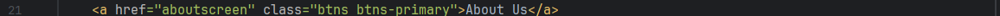

 WESTERN GOVERNORS UNIVERSITY 
D287 – JAVA FRAMEWORKS

Section C. 
 
    -mainscreen.html, line 13: Added a CSS reference link to Demo.css
    -mainscreen.html, line 15: Changed the title from "Shop" to "My Dominican Motorcycle Shop".
    -mainscreen.html, line 20: Added a class to the <h1> tag called "gradient-text".
    -mainscreen.html, line 20: Added a div with the class called "flag" with an img src link to an image of the Dominican flag.
    -mainscreen.html,line 20: Changed the text within the <h1> tag to "The Dominican Motorcycle Shop".

    -demo.css, line 1: Added css to ".gradient-text" to change the color of the text within the <h1> tag.
    -demo.css,line 9: Added a background image of an island coast and changed the color of the text within to aliceblue.
    -demo.css, line 19: Changed the color within class ".thead-dark" to alice blue.
    -demo.css, line 21: Changed color within <tr> tag of the tables to dodger blue and text to aliceblue.

    
Section D.

    -About.html, line 1 to line 56: Created an "about me" page with a button to link to "/mainscreen".

    -AboutScreenController.java, line 1 to line 12, Created a new class that maps the "aboutscreen" page. 

    -demo.css, line 25: Added a new background image,shaped it to fit the screen, and changed the color of the font to aliceblue.
    -demo.css, line 36: Added class ".text-and-flag" with a flex display so the image and text can be side by side.
    -demo.css, line 41: Added ".flag" class to adjust the size of the image.
    -demo.css, line 46: Added ".gradient-text h1" to color the "About Us" text.

    -demo.css, line 54: Added "text-content p". Changed the font to cambria, changed the margin  and colored the background to mirror the Dominican flag colors.
    -demo.css, line 62: Added "text-content h1" to adjust the bottom margin of the text.
    -demo.css, line 66: Added "second-para" to align and shape the second paragraph.
    -demo.css, line 73: Added "second-para p" to give it the background Dominican flag colors.
    -demo.css, line 82: Added "store-hours" class to adjust the width.

    -demo.css, line 86: Added "store-hours h3" to shorten the bottom marging of "Shop Hours"
    -demo.css, line 91: Added "store-hours p" to shorten the margins of the store times.
    -demo.css, line 96: Added "btns", used for both "aboutscreen" and "mainscreen" and colored the buttons the same as the Dominican flag.
    -demo.css, line 110: Added color to .btns:hover. 

    -mainscreen.html, line 21: Added a button, "About Us", to link to aboutscreen page.
    

Section E.

    -BootStrapData.java, line 45: Created an IF statement to prevent any duplicate outsourced parts.
    -BootStrapData.java, line 47 - line 53: Created an object called "Raider" thats holds the "Yamaha Raider Motor" item part information and saved it to OutsourcedPartRepository.
    -BootStrapData.java, line 55 - line 61: Created an object called "R125" thats holds the "Yamaha R125 Handlebars" item part information and saved it to OutsourcedPartRepository.
    -BootStrapData.java, line 63 - line 69: Created an object called "Gearshift" thats holds the "Honda Cargo125 Gear Shift Shaft" item part information and saved it to OutsourcedPartRepository.

    -BootStrapData.java, line 72: Created an IF statement to prevent any duplicate insourced parts.
    -BootStrapData.java, line 74 - line 79: Created an object called "Seats" thats holds the "Platinos Seats" item part information and saved it to InhousePartRepository.
    -BootStrapData.java, line 81 - line 86: Created an object called "Footpegs" thats holds the "Platinos Footpegs" item part information and saved it to InhousePartRepository.
    -BootStrapData.java, line 91: Created an IF statement to prevent any duplicate products.
    -BootStrapData.java, line 92: Created a Dominican Men's jacket object called "DRJacket", with it's name, price, and inventory quanity information.
    -BootStrapData.java, line 93: Created a Dominican Women's jacket object called "DRJacketF", with it's name, price, and inventory quanity information.
    -BootStrapData.java, line 94: Created a Dominican themed helmet object called "DRHelmet",with it's name, price, and inventory quanity information.
    -BootStrapData.java, line 95: Created a Dominican themed children's helmet object called "DRHelmetC", with it's name, price, and inventory quanity information.
    -BootStrapData.java, line 96: Created a Dominican themed synthetic oil product object called "DROil", with it's name, price, and inventory quanity information.
    -BootStrapData.java, line 97: Saved DRJacket to productRepository.
    -BootStrapData.java, line 98: Saved DRJacketF to productRepository.
    -BootStrapData.java, line 99: Saved DRHelmet to productRepository.
    -BootStrapData.java, line 100: Saved DRHelmetC to productRepository.
    -BootStrapData.java, line 101: Saved DROil to productRepository.

    -application.properties, line 6: Changed the datasource.url name to "cmorera_2".

Section F.

    -mainscreen.html,line 87: Added a "Buy Now" button that maps to /purchaseScreen. Located in the Product table.

    -BuyProductController.java, line 1 - line 32: Created "BuyProductController" to handle the behaviour of the purchase, decrementing the inventory of the item
        by one and redirect either to the success or failure page.

    -confirmationfailurebuy.html, line 1 - line 14: Created a failure page if the purchase process did not go through.

    -confirmationsuccessbuy.html, line 1 - line 12: Created a success page if purchase went through successfully.

Section G.